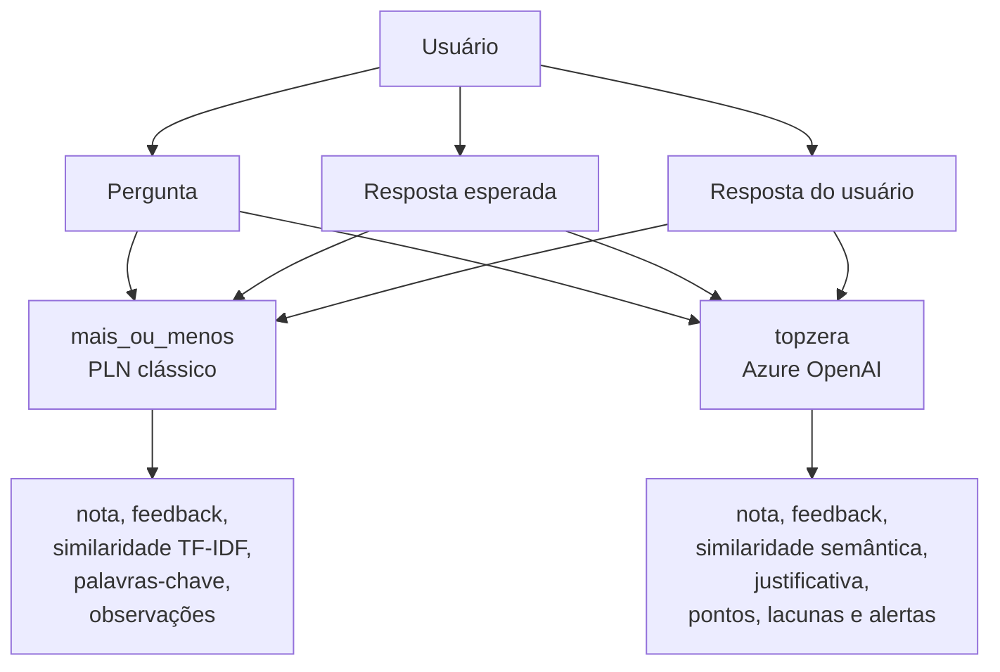
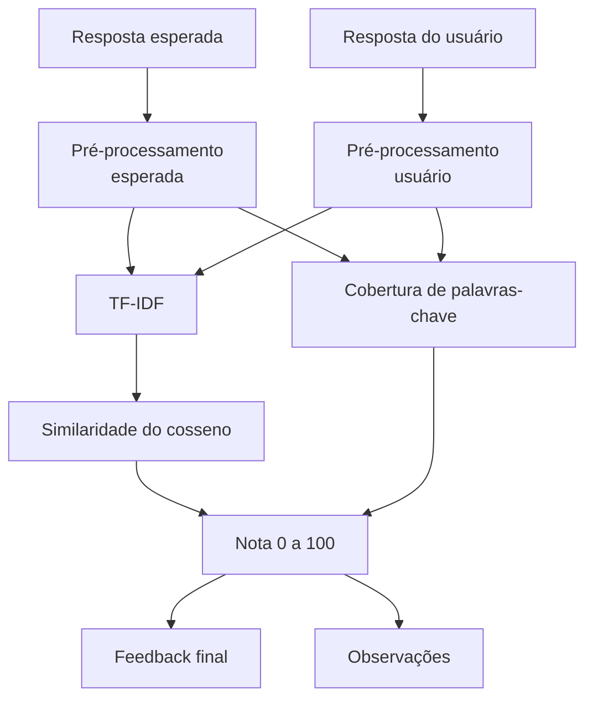
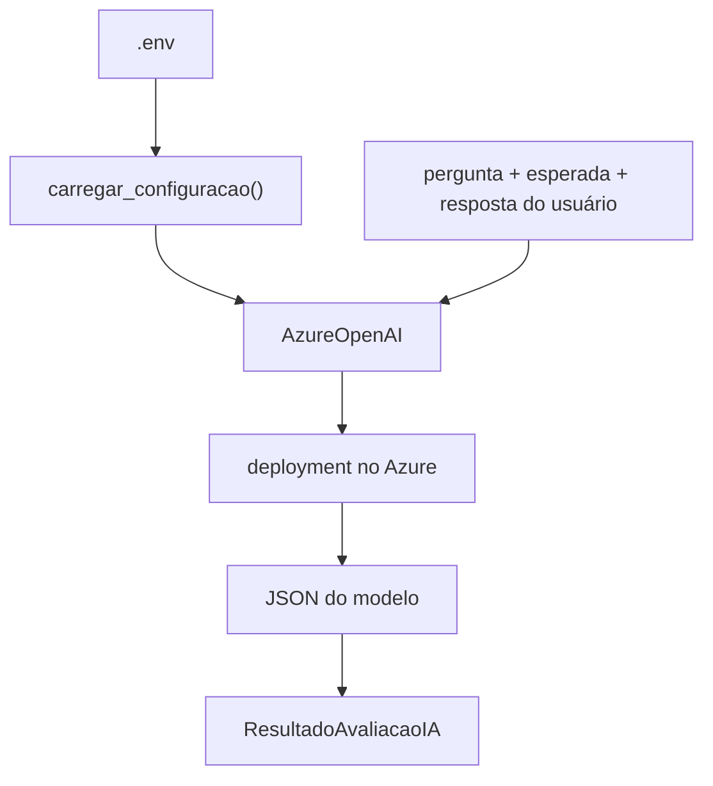

# Documentação técnica, Did It Understand?

## 1. Visão geral

O **Did It Understand?** é um projeto em Python para avaliar respostas textuais.

A entrada do sistema é:

- uma pergunta
- uma resposta esperada
- uma resposta escrita pelo usuário

A saída esperada é:

- uma nota de `0` a `100`
- um feedback, `Entendeu`, `Parcial` ou `Nao entendeu`
- indicadores que ajudam a explicar a avaliação

O repositório tem duas implementações:

- `mais_ou_menos`, versão determinística com PLN clássico, TF-IDF, similaridade do cosseno, stemming e palavras-chave
- `topzera`, versão com Azure OpenAI, que pede para um modelo avaliar a proximidade semântica da resposta

## 2. Tese do trabalho

Pergunta central:

```text
A máquina entendeu?
```

Resposta crítica:

```text
Depende da versão e do que chamamos de "entender".
```

Fato: a versão `mais_ou_menos` mede proximidade textual. Ela transforma as respostas em tokens, calcula vetores TF-IDF e compara esses vetores.

Fato: a versão `topzera` usa um modelo disponibilizado no Azure OpenAI para julgar significado, lacunas, acertos e contradições.

Inferência: a versão clássica é mais previsível e barata, mas tem dificuldade com sinônimos e paráfrases. A versão com IA lida melhor com significado, mas depende de API externa, credencial, deployment, internet e custo por uso.

Opinião técnica: para apresentação, a melhor abordagem é mostrar as duas versões. A primeira prova que o grupo entende o pipeline básico de PLN. A segunda mostra uma evolução prática, mais próxima de um avaliador semântico.

## 3. Estrutura atual do projeto

```text
did-it-understand/
├── Backup/
│   └── ...                         # Cópias antigas antes de alterações
├── mais_ou_menos/
│   ├── avaliador.py                # Motor TF-IDF, nota, feedback e observações
│   ├── exemplos.json               # Casos preparados para demonstração
│   ├── main.py                     # CLI da versão clássica
│   ├── preprocessamento.py         # Normalização, tokens, stopwords e stemming
│   ├── test_avaliador.py           # Testes unitários da versão clássica
│   └── testes_exemplos.py          # Executa exemplos e compara expectativa humana
├── topzera/
│   ├── avaliador_openai.py         # Motor semântico usando Azure OpenAI
│   ├── main.py                     # CLI da versão com IA
├── .env                            # Credenciais locais, não versionar
├── .env.exemple                    # Modelo de variáveis de ambiente
├── documentation.md                # Esta documentação técnica
├── GUIA_TRABALHO_PLN.md            # Resumo do enunciado
├── README.md                       # Guia único de uso
└── requirements.txt                # Dependências do projeto
```

## 4. Arquitetura geral



## 5. Preparação do ambiente

O padrão deste projeto é usar uma pasta chamada `venv`.

Criar ambiente virtual, quando ainda não existir:

```powershell
python -m venv venv
```

Instalar as dependências do projeto:

```powershell
venv\Scripts\python -m pip install -r requirements.txt
```

Validar importações da versão com IA:

```powershell
venv\Scripts\python -m py_compile topzera\avaliador_openai.py topzera\main.py
```

## 6. Dependências

### requirements.txt da raiz

Contém as bibliotecas do projeto.

Uso:

- `scikit-learn` para TF-IDF e similaridade
- `nltk` para stemming
- `Unidecode` para normalizar acentos
- `rich` para exibir tabelas e painéis no terminal
- `openai` para instanciar `AzureOpenAI` e chamar o deployment configurado no Azure
- `python-dotenv` para carregar variáveis do arquivo `.env`

## 7. Versão 1, mais_ou_menos

Esta é a versão baseada em PLN clássico.

Fluxo:



## 8. Pré-processamento

Arquivo:

```text
mais_ou_menos/preprocessamento.py
```

Responsabilidade:

- transformar texto natural em uma representação mais fácil de comparar

Etapas principais:

- converter para string
- passar para minúsculas
- remover acentos com `unidecode`
- substituir pontuação por espaços
- remover espaços repetidos
- tokenizar
- remover stopwords, quando configurado
- aplicar stemming, quando configurado

Exemplo conceitual:

```text
"Processamento de Linguagem Natural!"
```

Pode virar uma lista próxima de:

```text
["process", "lingu", "natural"]
```

Isso é útil para comparação, mas não é uma frase humana. É uma representação matemática reduzida.

## 9. Avaliador clássico

Arquivo:

```text
mais_ou_menos/avaliador.py
```

Função principal:

```text
avaliar_resposta(pergunta, resposta_esperada, resposta_usuario, configuracao=None)
```

Responsabilidades:

- validar configuração
- recusar resposta esperada vazia
- pré-processar resposta esperada
- pré-processar resposta do usuário
- extrair palavras-chave da resposta esperada
- calcular similaridade TF-IDF
- calcular cobertura de palavras-chave
- combinar as métricas em uma nota
- transformar nota em feedback
- gerar observações para interpretação

## 10. Cálculo da nota clássica

Regra padrão:

```text
nota_base = (similaridade * 0.8) + (cobertura_palavras_chave * 0.2)
nota = nota_base * 100
```

Feedback padrão:

- nota `>= 70`: `Entendeu`
- nota `>= 30` e `< 70`: `Parcial`
- nota `< 30`: `Nao entendeu`

Fato: a similaridade TF-IDF observa distribuição de termos.

Inferência: se a resposta do usuário repete termos centrais da resposta esperada, a nota tende a subir.

Risco: uma resposta conceitualmente correta com palavras diferentes pode ficar com nota baixa.

## 11. CLI clássica

Arquivo:

```text
mais_ou_menos/main.py
```

Modo interativo:

```powershell
venv\Scripts\python mais_ou_menos\main.py
```

Modo por argumentos:

```powershell
venv\Scripts\python mais_ou_menos\main.py --pergunta "O que é PLN?" --esperada "PLN é a área da computação que processa linguagem humana." --usuario "PLN analisa linguagem humana." --detalhes
```

Opções importantes:

- `--pergunta`, informa a pergunta
- `--esperada`, informa a resposta de referência
- `--usuario`, informa a resposta avaliada
- `--detalhes`, mostra tokens, radicais e palavras-chave
- `--manter-stopwords`, mantém palavras comuns
- `--sem-stemming`, desliga radicalização para comparar antes e depois

## 12. Exemplos clássicos

Arquivos:

```text
mais_ou_menos/exemplos.json
mais_ou_menos/testes_exemplos.py
```

Executar:

```powershell
venv\Scripts\python mais_ou_menos\testes_exemplos.py
```

Uso na apresentação:

- mostrar cenário
- mostrar expectativa humana
- mostrar resultado do sistema
- explicar por que bateu ou divergiu

## 13. Testes automatizados

Arquivo:

```text
mais_ou_menos/test_avaliador.py
```

Executar:

```powershell
venv\Scripts\python -m unittest discover -s mais_ou_menos -p "test*.py"
```

Os testes cobrem comportamentos como:

- remoção de acentos e pontuação
- aproximação por stemming
- resposta igual recebe nota máxima
- resposta vazia recebe nota baixa
- resposta errada fica abaixo do limite parcial

## 14. Versão 2, topzera

Esta é a versão com Azure OpenAI.

Ela não substitui obrigatoriamente a versão clássica. Ela funciona como uma comparação mais semântica.

Fluxo:



## 15. Configuração do Azure OpenAI

Arquivo de ambiente:

```text
.env
```

Variáveis esperadas:

```env
OPENAI_API_KEY=sua_chave_do_azure
AZURE_ENDPOINT=https://seu-recurso.cognitiveservices.azure.com/
AZURE_OPENAI_DEPLOYMENT=nome_do_seu_deployment
AZURE_OPENAI_API_VERSION=2024-12-01-preview
```

Nomes aceitos pelo código:

- chave: `AZURE_OPENAI_API_KEY` ou `OPENAI_API_KEY`
- endpoint: `AZURE_OPENAI_ENDPOINT` ou `AZURE_ENDPOINT`
- deployment: `AZURE_OPENAI_DEPLOYMENT`, `AZURE_OPENAI_MODEL`, `AZURE_DEPLOYMENT` ou `OPENAI_MODEL`
- versão da API: `AZURE_OPENAI_API_VERSION` ou `OPENAI_API_VERSION`

Ponto importante:

```text
model = nome do deployment no Azure
```

Não confunda com o nome público do modelo. Se no portal do Azure o deployment se chama `avaliador-aula`, é esse nome que precisa estar em `AZURE_OPENAI_DEPLOYMENT`.

## 16. Endpoint do Azure

O SDK espera o endpoint base do recurso:

```env
AZURE_ENDPOINT=https://seu-recurso.cognitiveservices.azure.com/
```

O código em `topzera/avaliador_openai.py` tenta normalizar URLs que vierem com caminho extra, por exemplo:

```text
https://seu-recurso.cognitiveservices.azure.com/openai/responses?api-version=...
```

Mesmo assim, a forma recomendada no `.env` é o endpoint base.

## 17. Temperatura

Por padrão, a versão `topzera` não envia `temperature`.

Motivo:

- alguns deployments aceitam apenas a temperatura padrão
- nesses casos, enviar `temperature=0.0` pode causar erro `400`

Se o deployment aceitar temperatura configurável, use:

```env
AZURE_OPENAI_TEMPERATURE=1
```

Opinião técnica: para este trabalho, a temperatura padrão é suficiente. O mais importante é que a avaliação seja explicável pelo JSON de saída.

## 18. Avaliador com IA

Arquivo:

```text
topzera/avaliador_openai.py
```

Elementos principais:

- `ConfiguracaoAzureOpenAI`, guarda chave, endpoint, deployment, versão da API e temperatura opcional
- `ResultadoAvaliacaoIA`, representa a avaliação retornada ao usuário
- `carregar_configuracao()`, valida credenciais e parâmetros mínimos
- `load_dotenv()`, chamado dentro da configuração para carregar o `.env` com `python-dotenv`
- `normalizar_endpoint_azure()`, remove caminho `/openai/...` quando ele aparece no endpoint
- `criar_cliente()`, instancia `AzureOpenAI`
- `montar_mensagens()`, cria instrução de sistema e tarefa do usuário
- `avaliar_resposta_com_ia()`, chama o modelo e monta o resultado final

## 19. Formato esperado da IA

O prompt pede um JSON neste formato:

```json
{
  "nota": 0,
  "feedback": "Parcial",
  "similaridade_semantica": 0.0,
  "justificativa": "texto curto",
  "pontos_corretos": ["texto curto"],
  "lacunas": ["texto curto"],
  "alertas": ["texto curto"]
}
```

O código normaliza a resposta:

- limita nota entre `0` e `100`
- limita similaridade entre `0.0` e `1.0`
- converte feedback para um dos três rótulos esperados
- transforma listas ausentes em listas vazias
- rejeita JSON inválido com erro explícito

## 20. CLI com IA

Arquivo:

```text
topzera/main.py
```

Validar configuração sem chamar a API:

```powershell
venv\Scripts\python topzera\main.py --check-config
```

Modo interativo:

```powershell
venv\Scripts\python topzera\main.py
```

Modo por argumentos:

```powershell
venv\Scripts\python topzera\main.py --pergunta "O que é PLN?" --esperada "PLN é a área da computação que processa linguagem humana." --usuario "É uma área que permite analisar textos de pessoas."
```

Saída esperada:

- feedback
- nota
- similaridade semântica
- justificativa
- pontos corretos
- lacunas
- alertas

## 21. Comparação técnica

| Critério | `mais_ou_menos` | `topzera` |
| --- | --- | --- |
| Técnica | TF-IDF e cosseno | Modelo via Azure OpenAI |
| Custo por avaliação | praticamente zero localmente | pode cobrar tokens na Azure |
| Internet | não precisa para executar depois de instalado | precisa para chamar API |
| Explicabilidade | alta, métricas simples | média, depende da justificativa do modelo |
| Paráfrases | dificuldade maior | tendência a avaliar melhor |
| Reprodutibilidade | alta | pode variar por modelo, deployment e configuração |
| Alinhamento com aula básica | alto | funciona como evolução |
| Manutenção | simples | exige credenciais, endpoint e deployment |

## 22. Tratamento de erros

Na versão clássica:

- resposta esperada vazia gera `ValueError`
- resposta do usuário vazia recebe nota baixa
- configuração com pesos inválidos gera erro

Na versão Azure OpenAI:

- falta de chave gera erro de configuração
- falta de endpoint gera erro de configuração
- falta de deployment gera erro de configuração
- ausência da biblioteca `openai` gera mensagem com comando de instalação
- resposta JSON inválida gera erro específico
- endpoint com caminho extra é normalizado antes de criar o cliente
- `temperature` só é enviado quando configurado

## 23. Validação recomendada

Antes da apresentação:

```powershell
venv\Scripts\python -m unittest discover -s mais_ou_menos -p "test*.py"
venv\Scripts\python -m py_compile topzera\avaliador_openai.py topzera\main.py
venv\Scripts\python topzera\main.py --check-config
```

Depois, faça testes manuais com pelo menos:

- resposta idêntica à esperada
- resposta correta usando sinônimos
- resposta incompleta
- resposta errada, mas com palavras parecidas
- resposta vaga
- resposta com contradição

## 24. Observabilidade e ambiente real

Para um trabalho acadêmico, imprimir o resultado no terminal é suficiente.

Para um ambiente real, seria recomendável adicionar:

- logging de erro sem gravar chave de API
- identificador de cada avaliação
- tempo de resposta da API
- contagem de avaliações por dia
- custo estimado por turma ou por exercício
- amostra de respostas revisadas por humano para calibrar a nota
- testes de regressão com respostas reais anonimizadas

Risco de negócio:

- um avaliador injusto pode prejudicar estudantes ou usuários
- uma chave exposta pode gerar custo indevido
- um deployment errado pode quebrar a entrega no dia da apresentação

Mitigação:

- manter `.env` fora do Git
- usar `--check-config` antes da demo
- preparar exemplos offline da versão `mais_ou_menos`
- explicar que a nota é apoio avaliativo, não veredito absoluto

## 25. Limitações

Limitações da versão clássica:

- não entende contexto profundo
- não entende intenção
- não valida fatos externos
- não reconhece todos os sinônimos
- pode favorecer repetição superficial de palavras-chave
- pode punir uma resposta correta escrita com outro vocabulário

Limitações da versão com IA:

- depende do deployment do Azure
- pode ter custo
- pode ficar indisponível por rede, cota ou credencial
- pode retornar uma justificativa convincente mesmo quando a nota merece revisão
- precisa de validação humana em usos importantes

## 26. Sugestão de apresentação

Roteiro recomendado:

1. Explique a pergunta do trabalho, "a máquina entendeu?"
2. Mostre rapidamente o fluxo de entrada e saída.
3. Rode a versão `mais_ou_menos`.
4. Explique pré-processamento, TF-IDF e cosseno.
5. Rode uma resposta correta e uma errada.
6. Rode uma paráfrase correta que a versão clássica avalia mal, se houver.
7. Rode a mesma paráfrase na versão `topzera`.
8. Compare os resultados.
9. Explique os trade-offs, simplicidade e transparência contra custo e semântica.
10. Conclua que a máquina calcula evidências de entendimento, mas a interpretação final precisa de senso crítico.

## 27. Melhorias futuras

Ideias sustentáveis:

- criar uma suíte de testes para `topzera` usando mock do cliente Azure
- salvar resultados em CSV para análise da turma
- criar matriz de comparação entre nota humana, nota TF-IDF e nota da IA
- adicionar embeddings como meio termo entre TF-IDF e juiz generativo
- permitir várias respostas esperadas por pergunta
- criar uma tela simples para professor revisar notas
- adicionar rubricas explícitas por pergunta
- estimar custo antes de avaliar uma lista grande de respostas
