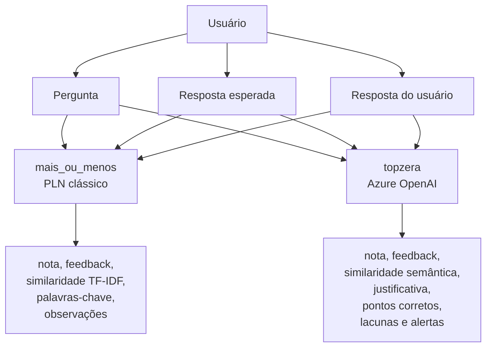
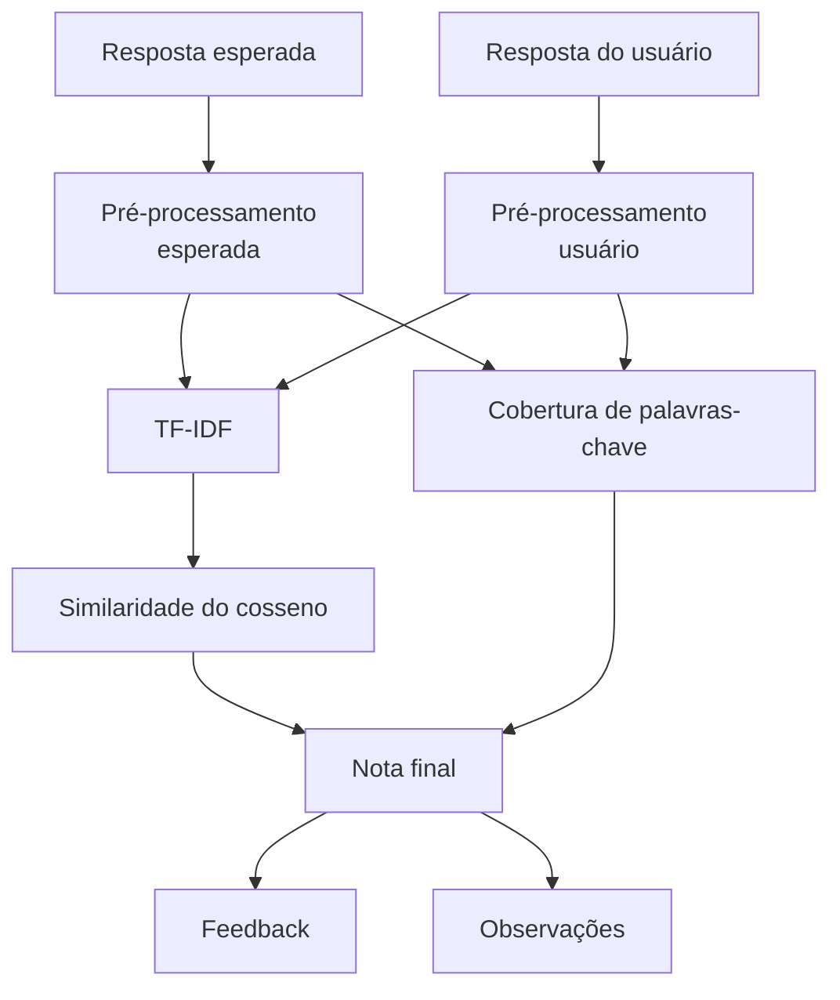
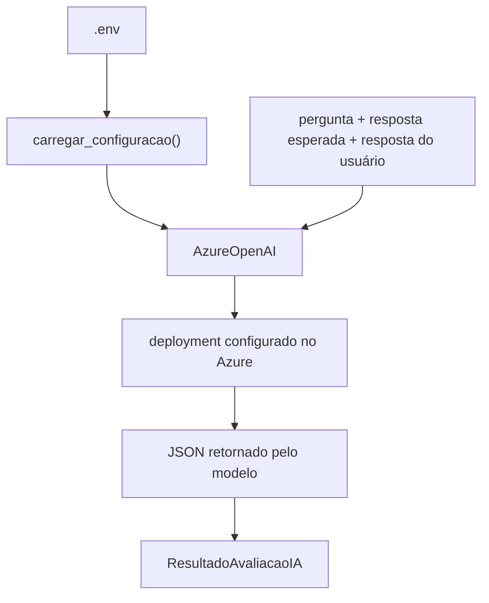

# Documentação Técnica

## Did It Understand?

Trabalho acadêmico da disciplina de Inteligência Artificial.

- Acadêmicos: Felipe Cidade Soares, Karolini Roncani Pedrozo Leonhard Henrique Carvalho Onofre e 
- Professora: Eliane
- Universidade: Universidade Federal de Santa Catarina (UFSC)
- Data: 21 de abril de 2026

## 1. Contexto do trabalho

O projeto **Did It Understand?** foi desenvolvido para investigar uma pergunta central da área de Inteligência Artificial aplicada à linguagem:

```text
A máquina entendeu a resposta do usuário?
```

Na prática, o sistema recebe três entradas:

- uma pergunta
- uma resposta esperada
- uma resposta fornecida pelo usuário

Com base nisso, ele gera:

- uma nota de `0` a `100`
- uma classificação qualitativa, `Entendeu`, `Parcial` ou `Nao entendeu`
- indicadores complementares para justificar o resultado

O trabalho foi estruturado em duas abordagens complementares:

- `mais_ou_menos`, uma solução determinística baseada em PLN clássico, TF-IDF, similaridade do cosseno, stemming e cobertura de palavras-chave
- `topzera`, uma solução baseada em Azure OpenAI, voltada para avaliação mais semântica da resposta

## 2. Objetivo acadêmico

O objetivo do trabalho não é afirmar que a máquina realmente "compreende" no sentido humano do termo. O propósito é demonstrar, de forma técnica e crítica, como diferentes abordagens de Inteligência Artificial podem estimar evidências de entendimento.

Fato:

- a versão `mais_ou_menos` mede principalmente proximidade textual e presença de termos relevantes
- a versão `topzera` utiliza um modelo de linguagem para avaliar significado, coerência, lacunas e aderência à resposta esperada

Inferência:

- as duas versões respondem à mesma pergunta de formas diferentes, o que permite comparar transparência, custo, robustez e qualidade semântica

Opinião técnica:

- essa combinação é superior a apresentar apenas uma solução, porque mostra maturidade acadêmica, domínio de fundamentos e capacidade de comparar uma abordagem clássica com uma abordagem moderna baseada em modelos generativos

## 3. Visão geral da solução

Em alto nível, o fluxo do sistema é o seguinte:



Esse desenho permite comparar uma abordagem de baixo custo e alta explicabilidade com outra de maior sofisticação semântica.

## 4. Estrutura do repositório

```text
did-it-understand/
├── Backup/
│   └── ...                         # Cópias anteriores dos arquivos alterados
├── mais_ou_menos/
│   ├── avaliador.py                # Motor de avaliação clássica
│   ├── exemplos.json               # Casos prontos para demonstração
│   ├── main.py                     # CLI da versão clássica
│   ├── preprocessamento.py         # Normalização, tokenização e stemming
│   ├── test_avaliador.py           # Testes unitários da versão clássica
│   └── testes_exemplos.py          # Execução de cenários demonstrativos
├── topzera/
│   ├── avaliador_openai.py         # Avaliador semântico com Azure OpenAI
│   └── main.py                     # CLI da versão com IA
├── .env                            # Credenciais locais e configuração
├── .env.exemple                    # Exemplo de variáveis de ambiente
├── documentation.md                # Esta documentação técnica
├── GUIA_TRABALHO.md                # Guia resumido do trabalho
├── README.md                       # Guia de uso do projeto
└── requirements.txt                # Dependências Python
```

## 5. Preparação do ambiente

O projeto foi organizado para utilizar um ambiente virtual chamado `venv`.

Criação do ambiente:

```powershell
python -m venv venv
```

Instalação das dependências:

```powershell
venv\Scripts\python -m pip install -r requirements.txt
```

Validação rápida dos arquivos principais:

```powershell
venv\Scripts\python -m py_compile mais_ou_menos\avaliador.py mais_ou_menos\main.py mais_ou_menos\preprocessamento.py topzera\avaliador_openai.py topzera\main.py
```

## 6. Dependências do projeto

As principais bibliotecas utilizadas são:

- `scikit-learn`, para vetorização TF-IDF e similaridade do cosseno
- `nltk`, para stemming em português
- `Unidecode`, para normalização de acentuação
- `rich`, para exibição estruturada no terminal
- `openai`, para acesso ao cliente `AzureOpenAI`
- `python-dotenv`, para carregar variáveis de ambiente a partir do `.env`

Impacto prático:

- essas dependências viabilizam um pipeline reprodutível e relativamente simples de manter
- na versão clássica, o custo operacional por avaliação tende a ser praticamente nulo após a instalação
- na versão com IA, surge custo de API, mas também cresce a capacidade de lidar com paráfrases e sentido

## 7. Versão 1, `mais_ou_menos`

### 7.1 Objetivo

A pasta `mais_ou_menos` contém a implementação determinística do projeto. Ela foi pensada para demonstrar fundamentos de Processamento de Linguagem Natural e para oferecer uma linha de base transparente e explicável.

### 7.2 Fluxo de processamento



### 7.3 Pré-processamento textual

Arquivo principal:

```text
mais_ou_menos/preprocessamento.py
```

Responsabilidades da etapa:

- converter texto para minúsculas
- remover acentos
- remover pontuação
- padronizar espaços
- tokenizar o texto
- remover stopwords, quando habilitado
- aplicar stemming, quando habilitado

Exemplo conceitual:

```text
"Processamento de Linguagem Natural!"
```

Pode ser transformado em algo próximo de:

```text
["process", "lingu", "natural"]
```

Fato:

- essa transformação facilita a comparação matemática entre respostas

Inferência:

- ao mesmo tempo, parte da nuance linguística é perdida, o que explica por que respostas semanticamente corretas podem receber nota menor do que o esperado

### 7.4 Motor de avaliação clássica

Arquivo principal:

```text
mais_ou_menos/avaliador.py
```

A função central é:

```text
avaliar_resposta(pergunta, resposta_esperada, resposta_usuario, configuracao=None)
```

Ela executa as seguintes etapas:

- valida a configuração de pesos e limites
- rejeita resposta esperada vazia
- preprocessa a resposta esperada
- preprocessa a resposta do usuário
- extrai palavras-chave da resposta esperada
- calcula a similaridade TF-IDF
- calcula a cobertura das palavras-chave
- combina os sinais em uma nota final
- converte a nota em feedback categórico
- gera observações interpretativas

### 7.5 Fórmula da nota

Regra padrão da implementação:

```text
nota_base = (similaridade * 0.8) + (cobertura_palavras_chave * 0.2)
nota = nota_base * 100
```

Faixas de classificação:

- nota `>= 70`: `Entendeu`
- nota `>= 30` e `< 70`: `Parcial`
- nota `< 30`: `Nao entendeu`

Fato:

- o peso principal está na similaridade textual

Inferência:

- a resposta tende a ser melhor avaliada quando reutiliza termos centrais da resposta esperada

Risco técnico:

- respostas corretas com vocabulário muito diferente podem ser subavaliadas

### 7.6 Interface de linha de comando

Arquivo:

```text
mais_ou_menos/main.py
```

Modo interativo:

```powershell
venv\Scripts\python mais_ou_menos\main.py
```

Modo por argumentos:

```powershell
venv\Scripts\python mais_ou_menos\main.py --pergunta "O que é PLN?" --esperada "PLN é a área da computação que processa linguagem humana." --usuario "PLN analisa linguagem humana." --detalhes
```

Parâmetros relevantes:

- `--pergunta`
- `--esperada`
- `--usuario`
- `--detalhes`
- `--manter-stopwords`
- `--sem-stemming`

### 7.7 Pontos fortes e limitações

Pontos fortes:

- baixo custo de execução
- alta reprodutibilidade
- fácil explicação em sala de aula
- comportamento previsível

Limitações:

- baixa sensibilidade semântica profunda
- dificuldade com sinônimos e paráfrases
- risco de premiar repetição superficial de palavras

## 8. Versão 2, `topzera`

### 8.1 Objetivo

A pasta `topzera` representa a evolução do trabalho para uma abordagem de avaliação semântica. Em vez de comparar apenas a forma textual, ela utiliza um modelo hospedado no Azure OpenAI para estimar proximidade de significado.

### 8.2 Fluxo da solução com IA



### 8.3 Configuração

Arquivo de referência:

```text
.env
```

Exemplo mínimo:

```env
OPENAI_API_KEY=sua_chave_do_azure
AZURE_ENDPOINT=https://seu-recurso.cognitiveservices.azure.com/
AZURE_OPENAI_DEPLOYMENT=nome_do_deployment
AZURE_OPENAI_API_VERSION=2024-12-01-preview
```

Nomes aceitos pelo código:

- chave: `AZURE_OPENAI_API_KEY` ou `OPENAI_API_KEY`
- endpoint: `AZURE_OPENAI_ENDPOINT` ou `AZURE_ENDPOINT`
- deployment: `AZURE_OPENAI_DEPLOYMENT`, `AZURE_OPENAI_MODEL`, `AZURE_DEPLOYMENT` ou `OPENAI_MODEL`
- versão da API: `AZURE_OPENAI_API_VERSION` ou `OPENAI_API_VERSION`

Ponto crítico:

```text
model = nome do deployment no Azure
```

Isso significa que o código não espera necessariamente o nome comercial do modelo, e sim o nome do deployment publicado no portal do Azure.

### 8.4 Avaliador semântico

Arquivo principal:

```text
topzera/avaliador_openai.py
```

Componentes importantes:

- `ConfiguracaoAzureOpenAI`, para armazenar credenciais e parâmetros
- `ResultadoAvaliacaoIA`, para representar o resultado final
- `carregar_configuracao()`, para validar e montar a configuração
- `normalizar_endpoint_azure()`, para limpar endpoints com caminho extra
- `criar_cliente()`, para instanciar o cliente `AzureOpenAI`
- `montar_mensagens()`, para construir o prompt
- `avaliar_resposta_com_ia()`, para chamar o modelo e estruturar o retorno

### 8.5 Formato de saída esperado

O prompt orienta o modelo a responder em JSON, no formato:

```json
{
  "nota": 0,
  "feedback": "Parcial",
  "similaridade_semantica": 0.0,
  "justificativa": "texto curto",
  "pontos_corretos": ["texto curto"],
  "lacunas": ["texto curto"],
  "alertas": ["texto curto"]
}
```

Após a resposta, o código ainda faz uma camada adicional de validação:

- limita a nota entre `0` e `100`
- limita a similaridade semântica entre `0.0` e `1.0`
- normaliza o feedback para os três rótulos oficiais do projeto
- converte listas ausentes em listas vazias
- lança erro quando o JSON retornado não é válido

### 8.6 Interface de linha de comando

Arquivo:

```text
topzera/main.py
```

Validar configuração sem chamar a API:

```powershell
venv\Scripts\python topzera\main.py --check-config
```

Modo interativo:

```powershell
venv\Scripts\python topzera\main.py
```

Modo por argumentos:

```powershell
venv\Scripts\python topzera\main.py --pergunta "O que é PLN?" --esperada "PLN é a área da computação que processa linguagem humana." --usuario "É uma área que permite analisar textos de pessoas."
```

### 8.7 Pontos fortes e limitações

Pontos fortes:

- maior capacidade de capturar sentido e paráfrase
- retorno mais rico, com justificativa textual
- melhor aderência a casos em que o aluno acerta com outras palavras

Limitações:

- depende de internet, credencial e deployment ativo
- pode gerar custo por uso
- apresenta menor reprodutibilidade que a versão clássica
- exige validação humana em usos relevantes

## 9. Comparação técnica entre as duas abordagens

| Critério                   | `mais_ou_menos`                    | `topzera`                             |
| --------------------------- | ------------------------------------ | --------------------------------------- |
| Técnica principal          | TF-IDF e similaridade do cosseno     | modelo via Azure OpenAI                 |
| Custo por avaliação       | praticamente zero após instalação | depende de consumo da API               |
| Dependência externa        | baixa                                | alta                                    |
| Explicabilidade             | alta                                 | média                                  |
| Sensibilidade a paráfrases | limitada                             | maior                                   |
| Reprodutibilidade           | alta                                 | moderada                                |
| Complexidade operacional    | baixa                                | média                                  |
| Adequação didática       | excelente para fundamentos           | excelente para discussão de IA moderna |

Melhor opção para apresentação:

- usar as duas

Justificativa:

- a versão clássica mostra domínio dos fundamentos
- a versão com IA amplia a discussão para semântica, custo, dependência de infraestrutura e limites dos modelos generativos
- juntas, elas enriquecem a análise crítica e deixam o trabalho mais completo

## 10. Testes e validação

Arquivo de testes automatizados da versão clássica:

```text
mais_ou_menos/test_avaliador.py
```

Execução:

```powershell
venv\Scripts\python -m unittest discover -s mais_ou_menos -p "test*.py"
```

Os testes cobrem:

- remoção de acentos e pontuação
- aproximação por stemming
- resposta idêntica com nota máxima
- resposta vazia com nota baixa
- resposta errada abaixo do limite parcial

Exemplos demonstrativos:

```powershell
venv\Scripts\python mais_ou_menos\testes_exemplos.py
```

Validação recomendada antes da apresentação:

```powershell
venv\Scripts\python -m unittest discover -s mais_ou_menos -p "test*.py"
venv\Scripts\python -m py_compile topzera\avaliador_openai.py topzera\main.py
venv\Scripts\python topzera\main.py --check-config
```

## 11. Aplicação prática e impacto

Embora o projeto tenha sido desenvolvido como trabalho acadêmico, ele dialoga com problemas reais.

Possíveis aplicações:

- apoio à correção inicial de respostas abertas
- triagem de respostas em atividades com grande volume
- padronização preliminar de feedback
- apoio ao professor na identificação de respostas incompletas

Impacto real potencial:

- ganho de eficiência na correção
- redução de esforço operacional em turmas maiores
- padronização parcial de critérios
- melhor escalabilidade em comparação com correção totalmente manual

Limite importante:

- o sistema não deve ser tratado como substituto absoluto do julgamento humano, principalmente em contextos avaliativos formais

## 12. Riscos e cuidados

Riscos técnicos e operacionais:

- um avaliador textual pode punir respostas corretas escritas com vocabulário diferente
- um avaliador com IA pode produzir justificativa convincente para uma nota discutível
- credenciais expostas podem gerar custo indevido
- falha de rede ou deployment pode inviabilizar a demonstração da versão com IA

Medidas de mitigação:

- manter o `.env` fora do versionamento
- validar o ambiente antes da apresentação
- preparar casos offline na versão `mais_ou_menos`
- tratar a nota como apoio à análise, não como verdade absoluta

## 13. Limitações acadêmicas e técnicas

Limitações da versão clássica:

- não compreende contexto profundo
- não distingue bem sinonímia complexa
- pode confundir repetição de termos com qualidade de resposta

Limitações da versão com IA:

- depende de infraestrutura externa
- depende de custo e disponibilidade da API
- pode variar conforme deployment, modelo e configuração
- ainda exige supervisão humana

Conclusão crítica:

- o sistema não prova compreensão no sentido humano
- ele estima evidências de aderência textual ou semântica
- por isso, a pergunta "a máquina entendeu?" deve ser respondida com cautela e senso crítico

## 14. Sugestão de roteiro para apresentação

1. Introduzir a pergunta central do trabalho.
2. Explicar rapidamente as entradas e saídas do sistema.
3. Demonstrar a versão `mais_ou_menos`.
4. Explicar pré-processamento, TF-IDF e similaridade do cosseno.
5. Mostrar um caso de acerto claro e um caso de erro claro.
6. Demonstrar um caso de paráfrase que desafie a versão clássica.
7. Executar a versão `topzera` com o mesmo exemplo.
8. Comparar os resultados das duas abordagens.
9. Discutir trade-offs entre transparência, custo e semântica.
10. Encerrar reforçando que o projeto mede evidências de entendimento, não entendimento absoluto.

## 15. Melhorias futuras

Evoluções sustentáveis para o projeto:

- criar testes automatizados para `topzera` com uso de mock da API
- armazenar resultados em CSV para análise posterior
- comparar nota humana, nota clássica e nota da IA em uma mesma base
- experimentar embeddings como solução intermediária entre TF-IDF e julgamento generativo
- permitir múltiplas respostas esperadas por pergunta
- construir uma interface simples para revisão docente
- adicionar rubricas explícitas por questão
- estimar custo antes de processar grandes volumes de respostas

## 16. Conclusão

O **Did It Understand?** é um trabalho acadêmico coerente com a disciplina de Inteligência Artificial porque articula fundamentos de Processamento de Linguagem Natural, avaliação automática e reflexão crítica sobre os limites da máquina.

Fato:

- o projeto entrega duas implementações funcionais para avaliação de respostas textuais

Inferência:

- a comparação entre as abordagens fortalece a análise acadêmica e demonstra entendimento técnico do problema

Opinião técnica:

- a principal qualidade do trabalho está em não tratar IA como mágica. Em vez disso, o projeto mostra que diferentes técnicas produzem sinais diferentes, com custos, vantagens e riscos próprios. Isso torna a entrega mais sólida, mais honesta e mais alinhada com uma visão profissional de uso de Inteligência Artificial.
