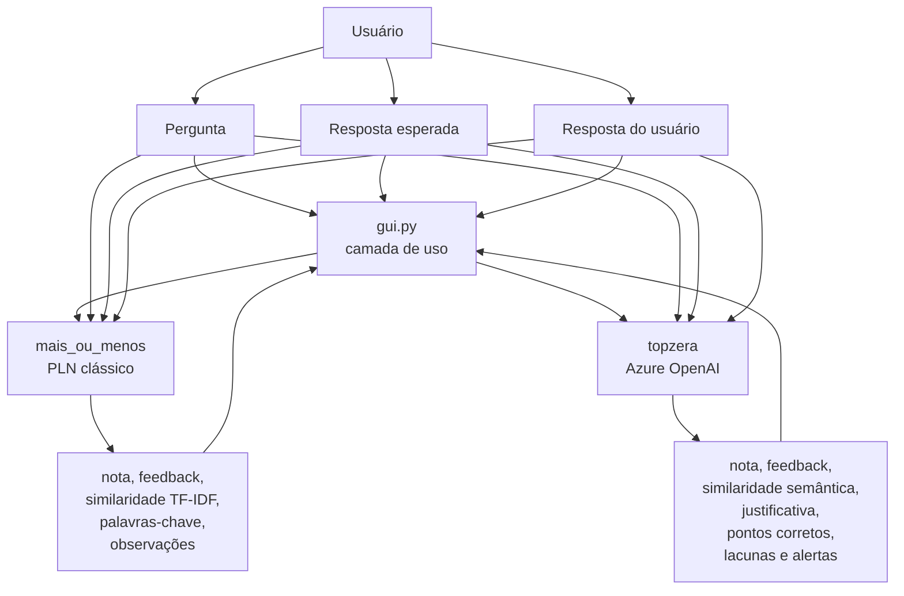
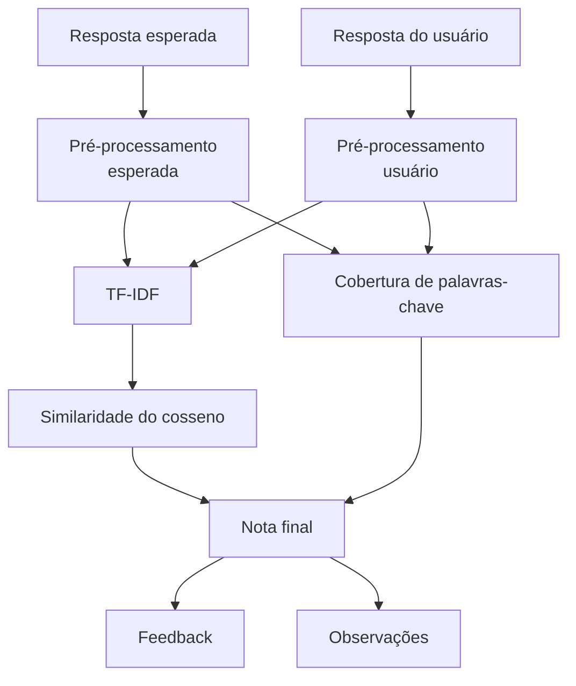

# Documentação Técnica

## Did It Understand?

Trabalho acadêmico da disciplina de Inteligência Artificial.

- Acadêmicos: Felipe Cidade Soares, Karolini Roncani Pedrozo e Leonhard Henrique Carvalho Onofre
- Professora: Eliane
- Universidade: Universidade Federal de Santa Catarina (UFSC)
- Data: 21 de abril de 2026

## 1. Contexto e estado atual

O projeto **Did It Understand?** investiga uma pergunta central da área de IA aplicada à linguagem:

```text
A máquina entendeu a resposta do usuário?
```

Na prática, o sistema recebe:

- uma pergunta;
- uma resposta esperada;
- uma resposta do usuário.

E retorna:

- uma nota de `0` a `100`;
- uma classificação qualitativa, `Entendeu`, `Parcial` ou `Não entendeu`;
- indicadores complementares para justificar o resultado.

O estado atual do projeto combina:

- `mais_ou_menos`, motor clássico de PLN com TF-IDF, similaridade do cosseno e cobertura de palavras-chave;
- `topzera`, motor semântico com Azure OpenAI;
- `gui.py`, interface gráfica em Tkinter que unifica os dois motores e oferece leitura operacional do resultado.

Fato:

- a GUI não implementa uma terceira lógica de avaliação;
- ela reutiliza os motores existentes e apenas adapta entrada, execução e apresentação.

Inferência:

- essa arquitetura reduz duplicação de regra de negócio e diminui risco de divergência entre terminal e interface gráfica.

Opinião técnica:

- essa decisão de design é superior a criar uma lógica paralela só para a tela, porque reduz custo de manutenção e melhora confiabilidade do projeto em ambiente real.

## 2. Mudanças incorporadas nesta versão documentada

As alterações mais relevantes que já existiam no código e agora passam a estar documentadas de forma consistente são:

- inclusão da interface gráfica `gui.py` como camada integrada de uso;
- atualização da árvore do repositório para refletir a estrutura real;
- inclusão do fluxo de execução da GUI junto com as duas CLIs;
- documentação da validação de credenciais do Azure OpenAI sem consumo de tokens;
- explicitação do gap atual de testes automatizados, que hoje cobre o motor clássico, mas não a GUI nem a integração real com Azure;
- ampliação das docstrings dos módulos `mais_ou_menos` e `topzera`, com foco em variáveis centrais, responsabilidades e impacto de cada etapa do fluxo.

Impacto prático:

- melhora onboarding de quem vai rodar o projeto pela primeira vez;
- reduz risco de apresentação falhar por documentação desatualizada;
- encurta tempo de suporte, porque o caminho de execução fica claro.

## 3. Visão geral da solução

Em alto nível, o fluxo do sistema é o seguinte:



Esse desenho permite três cenários de uso:

- correção textual rápida e reproduzível;
- correção semântica com apoio de modelo;
- demonstração integrada via interface gráfica.

## 4. Estrutura real do repositório

```text
did-it-understand/
├── gui.py                          # Interface gráfica unificada em Tkinter
├── mais_ou_menos/
│   ├── avaliador.py                # Motor de avaliação clássica
│   ├── exemplos.json               # Casos prontos para demonstração
│   ├── main.py                     # CLI da versão clássica
│   ├── preprocessamento.py         # Normalização, tokenização e stemming
│   ├── test_avaliador.py           # Testes unitários da versão clássica
│   └── testes_exemplos.py          # Execução de cenários demonstrativos
├── topzera/
│   ├── avaliador_openai.py         # Avaliador semântico com Azure OpenAI
│   └── main.py                     # CLI da versão com IA
├── .env                            # Credenciais locais, não versionadas
├── .env.exemple                    # Exemplo de variáveis de ambiente
├── .gitignore
├── documentacao_funcoes_pln.md     # Guia detalhado das funções e da GUI
├── documentation.md                # Esta documentação técnica
├── GUIA_TRABALHO.md                # Guia do enunciado e da apresentação
├── LICENSE
├── README.md
└── requirements.txt
```

## 5. Preparação do ambiente

O projeto foi organizado para utilizar um ambiente virtual chamado `venv`.

Criação do ambiente:

```powershell
python -m venv venv
```

Instalação das dependências:

```powershell
venv\Scripts\python -m pip install -r requirements.txt
```

Validação rápida dos arquivos principais:

```powershell
venv\Scripts\python -m py_compile gui.py mais_ou_menos\avaliador.py mais_ou_menos\main.py mais_ou_menos\preprocessamento.py topzera\avaliador_openai.py topzera\main.py
```

## 6. Dependências do projeto

As principais bibliotecas utilizadas são:

- `scikit-learn`, para vetorização TF-IDF e similaridade do cosseno;
- `nltk`, para stemming em português;
- `Unidecode`, para normalização de acentuação;
- `rich`, para exibição estruturada no terminal;
- `python-dotenv`, para carregar variáveis de ambiente do `.env`;
- `openai`, para acesso ao cliente `AzureOpenAI`;
- `tkinter`, já distribuído com instalações padrão do Python no Windows, para a GUI desktop.

Impacto prático:

- a versão clássica tem baixo custo de execução e baixo atrito de infraestrutura;
- a versão com IA amplia cobertura semântica, mas adiciona custo de API e dependência externa;
- a GUI aumenta usabilidade sem alterar o núcleo da lógica.

## 7. Modos de execução

### 7.1 GUI unificada

Arquivo principal:

```text
gui.py
```

Execução:

```powershell
venv\Scripts\python gui.py
```

A GUI entrega:

- escolha entre `Mais ou Menos` e `Topzera` na mesma tela;
- carregamento de exemplos prontos para demonstração;
- formulário único para pergunta, gabarito e resposta do usuário;
- painel de métricas;
- leitura técnica detalhada do resultado;
- validação de configuração do Azure OpenAI em segundo plano;
- execução assíncrona para evitar travamento visual.

Fato:

- a interface usa `threading` para não bloquear a thread principal durante chamadas de avaliação.

Inferência:

- isso reduz risco de parecer que a aplicação travou, o que melhora experiência de uso e segurança operacional em demonstrações.

### 7.2 CLI da versão clássica

Arquivo principal:

```text
mais_ou_menos/main.py
```

Execução:

```powershell
venv\Scripts\python mais_ou_menos\main.py
```

Ou com argumentos:

```powershell
venv\Scripts\python mais_ou_menos\main.py --pergunta "O que é PLN?" --esperada "PLN é a área da computação que processa linguagem humana." --usuario "PLN analisa linguagem humana." --detalhes
```

### 7.3 CLI da versão semântica

Arquivo principal:

```text
topzera/main.py
```

Check de configuração sem consumo de tokens:

```powershell
venv\Scripts\python topzera\main.py --check-config
```

Execução:

```powershell
venv\Scripts\python topzera\main.py --pergunta "O que é PLN?" --esperada "PLN é a área da computação que processa linguagem humana." --usuario "É uma área que permite analisar textos de pessoas."
```

## 8. Versão 1, `mais_ou_menos`

### 8.1 Objetivo

A pasta `mais_ou_menos` contém a implementação determinística do projeto. Ela serve como linha de base explicável, barata e reproduzível.

### 8.2 Fluxo de processamento



### 8.3 Pré-processamento textual

Responsabilidades:

- converter texto para minúsculas;
- remover acentos;
- remover pontuação;
- padronizar espaços;
- tokenizar o texto;
- remover stopwords, quando habilitado;
- aplicar stemming, quando habilitado.

### 8.4 Fórmula da nota

Regra padrão da implementação:

```text
nota_base = (similaridade * 0.8) + (cobertura_palavras_chave * 0.2)
nota = nota_base * 100
```

Faixas de classificação:

- nota `>= 70`: `Entendeu`;
- nota `>= 30` e `< 70`: `Parcial`;
- nota `< 30`: `Não entendeu`.

Fato:

- o peso principal está na similaridade textual.

Risco técnico:

- respostas corretas com vocabulário muito diferente podem ser subavaliadas.

### 8.5 Funções centrais e variáveis importantes

As funções mais importantes do motor clássico são:

- `preprocessar_texto()`, que transforma o texto bruto em `normalizado`, `tokens`, `tokens_comparacao` e `texto_processado`;
- `calcular_similaridade_tfidf()`, que cria `documento_esperado`, `documento_usuario`, `matriz_tfidf` e `matriz_similaridade`;
- `avaliar_resposta()`, que usa `resposta_esperada_proc`, `resposta_usuario_proc`, `palavras_chave`, `palavras_encontradas`, `cobertura_palavras_chave`, `similaridade`, `nota_base` e `feedback`.

Impacto prático:

- essa separação melhora interpretabilidade;
- facilita depuração em sala ou em banca;
- reduz risco de tratar a nota como caixa-preta.

## 9. Versão 2, `topzera`

### 9.1 Objetivo

A pasta `topzera` representa a evolução do trabalho para uma abordagem de avaliação semântica. Em vez de comparar apenas forma textual, ela usa um deployment do Azure OpenAI para estimar aderência de significado.

### 9.2 Configuração

Exemplo mínimo recomendado:

```env
AZURE_OPENAI_API_KEY=sua_chave_do_azure
AZURE_OPENAI_ENDPOINT=https://seu-recurso.cognitiveservices.azure.com/
AZURE_OPENAI_DEPLOYMENT=nome_do_deployment
AZURE_OPENAI_API_VERSION=2024-12-01-preview
```

Nomes aceitos pelo código:

- chave: `AZURE_OPENAI_API_KEY` ou `OPENAI_API_KEY`;
- endpoint: `AZURE_OPENAI_ENDPOINT` ou `AZURE_ENDPOINT`;
- deployment: `AZURE_OPENAI_DEPLOYMENT`, `AZURE_OPENAI_MODEL`, `AZURE_DEPLOYMENT` ou `OPENAI_MODEL`;
- versão da API: `AZURE_OPENAI_API_VERSION` ou `OPENAI_API_VERSION`.

Ponto crítico:

```text
model = nome do deployment no Azure
```

### 9.3 Formato de saída esperado

O prompt orienta o modelo a responder em JSON, no formato:

```json
{
  "nota": 0,
  "feedback": "Parcial",
  "similaridade_semantica": 0.0,
  "justificativa": "texto curto",
  "pontos_corretos": ["texto curto"],
  "lacunas": ["texto curto"],
  "alertas": ["texto curto"]
}
```

Depois da resposta, o código ainda:

- limita a nota entre `0` e `100`;
- limita a similaridade entre `0.0` e `1.0`;
- normaliza o feedback para a taxonomia oficial do projeto;
- converte listas ausentes em listas vazias;
- falha cedo quando o JSON não é válido.

### 9.4 Pontos fortes e limitações

Pontos fortes:

- maior capacidade de capturar sentido e paráfrase;
- retorno mais rico, com justificativa textual;
- melhor aderência a respostas corretas escritas com outras palavras.

Limitações:

- depende de internet, credencial e deployment ativo;
- pode gerar custo por uso;
- apresenta menor reprodutibilidade que a versão clássica;
- exige validação humana em usos relevantes.

### 9.5 Funções centrais e variáveis importantes

As funções mais importantes do motor semântico são:

- `carregar_configuracao()`, que consolida `api_key`, `endpoint`, `deployment`, `api_version` e `temperatura`;
- `normalizar_endpoint_azure()`, que usa `partes`, `caminho`, `indice_openai` e `endpoint_limpo` para tolerar erros comuns de configuração;
- `avaliar_resposta_com_ia()`, que cria `cliente`, monta `parametros`, recebe `resposta`, extrai `conteudo`, converte para `dados` e chama `montar_resultado()`;
- `montar_resultado()`, que saneia `nota`, `similaridade`, `feedback`, `pontos_corretos`, `lacunas` e `alertas`.

Impacto prático:

- melhora robustez contra respostas malformadas da API;
- reduz custo de diagnóstico quando o problema está na configuração e não no modelo;
- torna a integração mais segura para uso em demonstração e manutenção futura.

## 10. Camada de interface gráfica

### 10.1 Papel arquitetural

A GUI foi implementada como camada de orquestração e apresentação.

Ela faz:

- coleta de entrada;
- escolha do modo de avaliação;
- adaptação do resultado para uma visualização única;
- tratamento de erros para uso humano;
- verificação de configuração do Azure;
- atualização visual de status, nota e métricas.

Fato:

- o objeto `ResultadoTela` desacopla a saída dos motores da interface visual.

Inferência:

- isso permite evoluir layout e experiência sem reescrever a lógica dos motores.

### 10.2 Recursos operacionais da GUI

Recursos que merecem destaque:

- alternância entre os modos `Mais ou Menos` e `Topzera`;
- leitura de exemplos de `mais_ou_menos/exemplos.json`;
- botão de "Nova pergunta" para limpar o formulário sem reiniciar a aplicação;
- painel técnico com observações, palavras-chave, justificativa e métricas;
- medidor visual da nota;
- validação assíncrona das credenciais do Azure;
- mensagens de erro amigáveis para reduzir retrabalho do usuário.

Impacto real:

- menor tempo de preparação para apresentação;
- menos chance de erro manual ao alternar entre os dois avaliadores;
- ganho de eficiência em uso exploratório e correção assistida.

### 10.3 Trade-offs

Benefícios:

- melhor experiência de uso;
- menor dependência de linha de comando em demonstrações;
- maior clareza para público não técnico.

Custos:

- ainda não há teste automatizado específico para a camada visual;
- a GUI aumenta superfície de manutenção de interface;
- problemas do Azure continuam existindo no modo `Topzera`, apenas com melhor tratamento de uso.

## 11. Testes e validação

Arquivo de testes automatizados da versão clássica:

```text
mais_ou_menos/test_avaliador.py
```

Execução:

```powershell
venv\Scripts\python -m unittest discover -s mais_ou_menos -p "test*.py"
```

Os testes cobrem:

- remoção de acentos e pontuação;
- aproximação por stemming;
- resposta idêntica com nota máxima;
- resposta vazia com nota baixa;
- resposta errada abaixo do limite parcial.

Validação recomendada antes da apresentação:

```powershell
venv\Scripts\python -m unittest discover -s mais_ou_menos -p "test*.py"
venv\Scripts\python -m py_compile gui.py mais_ou_menos\avaliador.py mais_ou_menos\main.py mais_ou_menos\preprocessamento.py topzera\avaliador_openai.py topzera\main.py
venv\Scripts\python topzera\main.py --check-config
```

Validação manual recomendada da GUI:

- carregar exemplo pronto e avaliar no modo `Mais ou Menos`;
- trocar para `Topzera` e validar o check de credenciais;
- testar resposta vazia, resposta parcial e resposta errada;
- confirmar se o painel técnico muda de acordo com o motor escolhido.

Fato:

- não há teste automatizado para `gui.py`;
- também não há teste com mock para o cliente do Azure OpenAI.

Opinião técnica:

- esse é o principal gap atual do projeto se a intenção for evoluir de trabalho acadêmico para ferramenta mais robusta.

## 12. Aplicação prática e impacto

Embora o projeto tenha sido desenvolvido como trabalho acadêmico, ele dialoga com problemas reais.

Possíveis aplicações:

- apoio à correção inicial de respostas abertas;
- triagem de respostas em atividades com grande volume;
- padronização preliminar de feedback;
- apoio ao professor na identificação de respostas incompletas.

Impacto real potencial:

- ganho de eficiência na correção;
- redução de esforço operacional em turmas maiores;
- melhor experiência de uso com a GUI para revisões manuais;
- possibilidade de comparar custo baixo e explicabilidade contra maior sensibilidade semântica.

## 13. Riscos e cuidados

Riscos técnicos e operacionais:

- um avaliador textual pode punir respostas corretas escritas com vocabulário diferente;
- um avaliador com IA pode produzir justificativa convincente para uma nota discutível;
- credenciais expostas podem gerar custo indevido;
- falha de rede ou deployment pode inviabilizar o modo `Topzera`;
- a GUI melhora operação, mas não elimina falhas da infraestrutura externa.

Medidas de mitigação:

- manter o `.env` fora do versionamento;
- validar ambiente antes da apresentação;
- preparar casos offline na versão `mais_ou_menos`;
- tratar a nota como apoio à análise, não como verdade absoluta;
- acrescentar mocks e testes de integração controlada em evoluções futuras.

## 14. Melhorias futuras

Evoluções sustentáveis para o projeto:

- criar testes automatizados para `topzera` com uso de mock da API;
- criar testes de fumaça para a GUI;
- armazenar resultados em CSV para análise posterior;
- comparar nota humana, nota clássica e nota da IA em uma mesma base;
- experimentar embeddings como solução intermediária entre TF-IDF e julgamento generativo;
- permitir múltiplas respostas esperadas por pergunta;
- construir uma camada de revisão docente com histórico de avaliações;
- estimar custo antes de processar grandes volumes de respostas.

## 15. Conclusão

O **Did It Understand?** é um trabalho acadêmico tecnicamente coerente porque articula:

- fundamentos clássicos de PLN;
- avaliação semântica baseada em modelo;
- uma camada de uso real via interface gráfica.

Fato:

- o projeto entrega dois motores funcionais e uma GUI integrada para operação manual.

Inferência:

- a combinação dessas camadas fortalece a análise acadêmica e melhora a utilidade prática da solução.

Opinião técnica:

- a principal qualidade do trabalho está em equilibrar transparência, semântica e usabilidade. Isso torna a entrega mais profissional, mais fácil de demonstrar e mais honesta sobre os limites do que realmente significa "entender" uma resposta.
